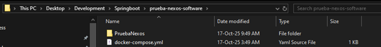
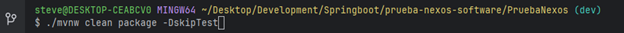
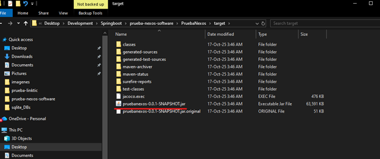
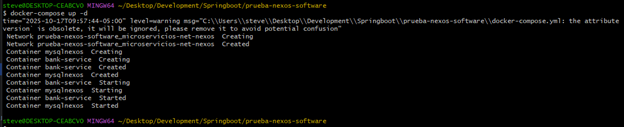
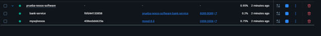
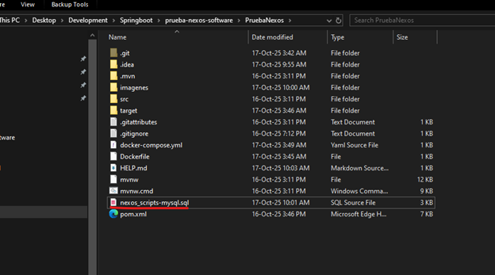
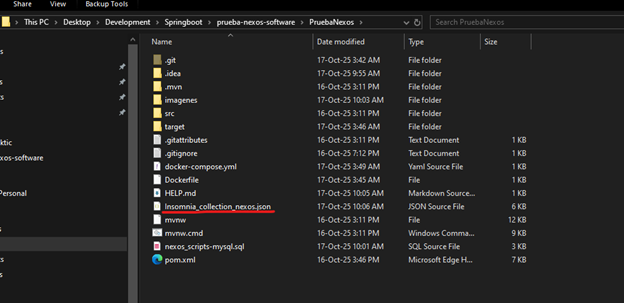
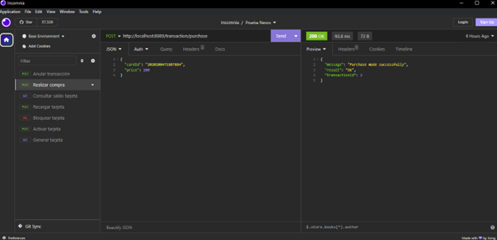

# Despliegue con Docker

En una carpeta vacía ubicar el archivo docker-compose.yml (que esta en la raiz del proyecto del repositorio) y en esa misma carpeta ubicar el repositorio:

- **https://github.com/stevenv17/PruebaNexos.git**

Ubicarse en la raíz del microservicio y crear el archivo jar con el comando “**./mvnw clean package -DskipTest**”:

Después desde la ruta donde está ubicado el archivo docker-compose.yml ejecutar el comando “docker-compose up -d” para crear y subir los contenedores de los microservicio y la base de datos:

Y ejecutar los scripts del **archivo nexos_scripts-mysql.sql** (en la raiz del proyecto) para crear modelo de base de datos.

# Colección peticiones:

En la raiz del proyecto esta la colección de peticiones (Insomnia_collection_nexos.json) que puede importarse a Insomnia o Postman:

